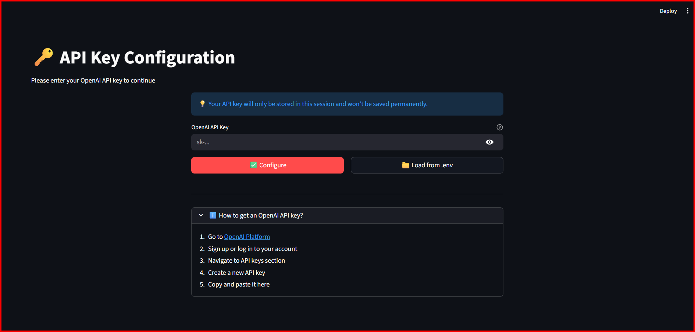
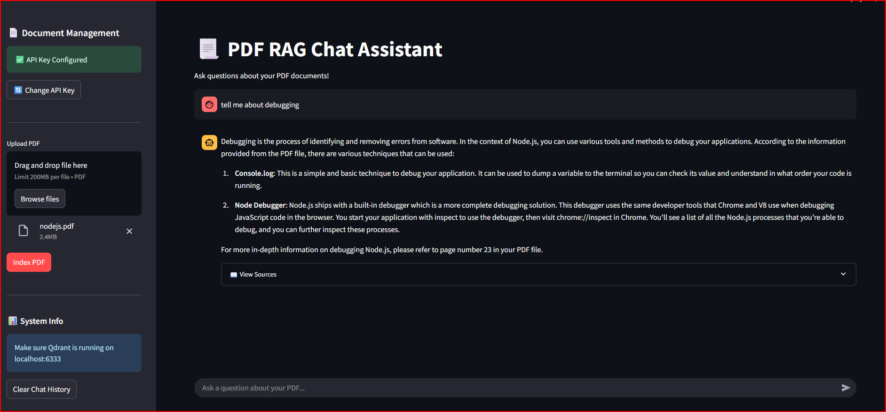
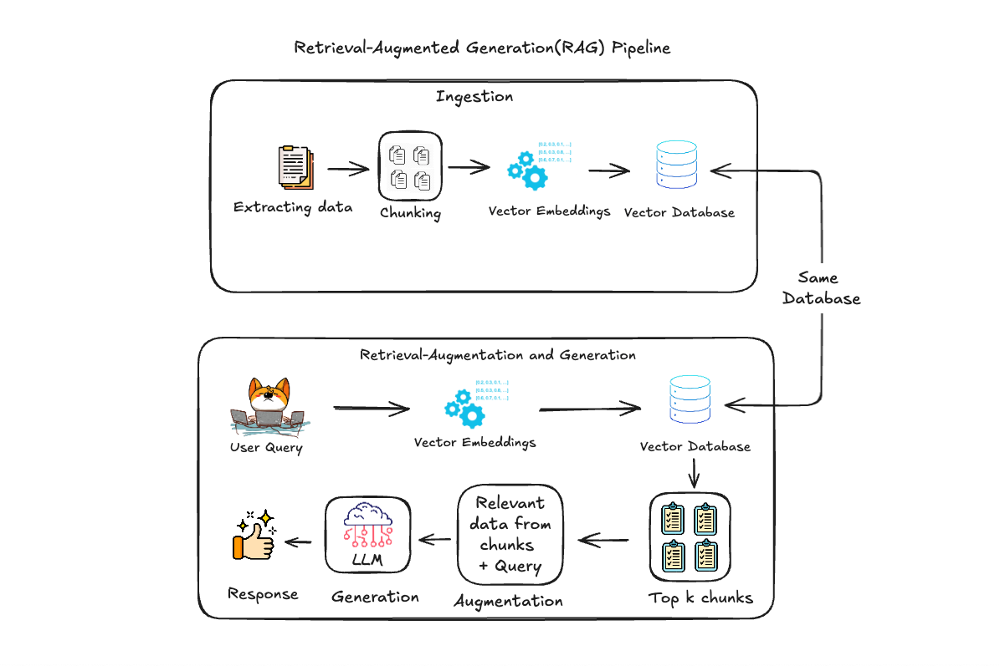

# 📄 PDF RAG Chat Assistant

A Retrieval-Augmented Generation (RAG) application that allows you to chat with your PDF documents using OpenAI's GPT models and Qdrant vector database.

**[Try the Live Demo](https://pdf-chat-rag-model.streamlit.app/)**

## Features

- **Interactive PDF Chat**: Ask questions about your PDF documents and get accurate, context-aware answers
- **Streamlit Web Interface**: User-friendly chat interface with source citations
- **Vector Search**: Efficient similarity search using Qdrant vector database
- **Source Citations**: View the exact pages and content used to generate answers
- **Command Line Interface**: Alternative CLI tool for quick queries
- **Secure API Key Management**: Multiple options for configuring your OpenAI API key

## 📸 Screenshots

### API Key Configuration

### Chat Interface

## Architecture

The application uses a RAG (Retrieval-Augmented Generation) pipeline:

1. **Document Indexing**: PDFs are loaded, split into chunks, and embedded using OpenAI's text-embedding-3-large model
2. **Vector Storage**: Embeddings are stored in Qdrant vector database for efficient retrieval
3. **Query Processing**: User queries are embedded and similar document chunks are retrieved
4. **Answer Generation**: Retrieved context is sent to GPT-4 to generate accurate, contextual answers

## How It Works

1. **Upload & Index**: Upload a PDF through the web interface or use `index.py` to index documents
2. **Chunking**: The PDF is split into smaller, overlapping chunks for better context retention
3. **Embedding**: Each chunk is converted to a vector embedding using OpenAI's embedding model
4. **Storage**: Embeddings are stored in Qdrant with metadata (page numbers, source)
5. **Query**: When you ask a question, it's embedded and compared against stored vectors
6. **Retrieval**: The most similar chunks are retrieved from the database
7. **Generation**: Retrieved context is sent to GPT-4 to generate a comprehensive answer

## License

This project is licensed under the MIT License - see the [LICENSE](LICENSE) file for details.

## 🔗 Resources

- [LangChain Documentation](https://python.langchain.com/)
- [Qdrant Documentation](https://qdrant.tech/documentation/)
- [OpenAI API Documentation](https://platform.openai.com/docs/)
- [Streamlit Documentation](https://docs.streamlit.io/)

